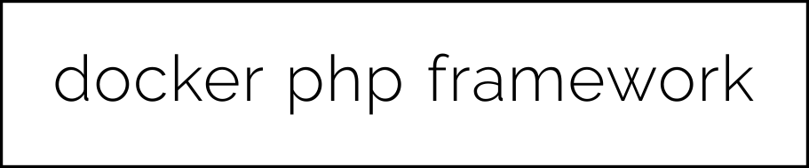

<p align="center">
  
</p>

<br/><br/>

### 1 - PREPARING THE DOCKER STACK
---
This docker is useful for running the latest php frameworks, such as laravel 8 or code igniter 4. 
It includes Composer and all the php extensions needed to run both frameworks above.
To use docker-php-framework, follow the steps below

- Clone this repo
```sh
> git clone https://github.com/berrabe/docker-php-framework.git
> cd docker-php-framework
```

- build image for php, and then run the stack
```sh
> docker-compose build
> docker-compose up -d
```

- Now, you can check the stack with `docker ps -a` command
```sh
CONTAINER ID        IMAGE                        COMMAND                  CREATED             STATUS                    PORTS                    NAMES
58ef1a4d0ef0        mhzawadi/phpmyadmin          "/config/start.sh ng…"   30 minutes ago      Up 30 minutes (healthy)   0.0.0.0:8081->80/tcp     dockerphpframework_phpmyadmin_1
37194b6f93e3        yobasystems/alpine-mariadb   "/scripts/run.sh"        30 minutes ago      Up 30 minutes             3306/tcp                 dockerphpframework_mariaDB_1
a03bfe272010        nginx:alpine                 "/docker-entrypoint.…"   33 minutes ago      Up 33 minutes             0.0.0.0:80->80/tcp       dockerphpframework_nginx_1
be85090c2b87        dockerphpframework_php       "docker-php-entrypoi…"   33 minutes ago      Up 33 minutes             9000/tcp                 dockerphpframework_php_1
```

<br/><br/>

### 2 - INSTALL THE PHP FRAMEWORK
---
- <b>LARAVEL 8</b>

if you want to install laravel 8, you can install it with composer by checking the official laravel documentation here https://laravel.com/docs/8.x/installation. 
Or you can see the steps below

```sh
> docker exec dockerphpframework_php_1 composer global require laravel/installer
> docker exec dockerphpframework_php_1 composer create-project --prefer-dist laravel/laravel < YOUR PROJECT DIR NAME >
```

<br/>

- <b>CODE IGNITER 4</b>

if you want to install code igniter 4, you can install it with composer by checking the official code igniter documentation here https://codeigniter4.github.io/userguide/installation/installing_composer.html. 
Or you can see the steps below

```sh
> docker exec dockerphpframework_php_1 composer create-project codeigniter4/appstarter < YOUR PROJECT DIR NAME >
```

<br/><br/>

### 3 - DEV / DEPLOY
---

By default, this docker is used for development using the php framework, you can access all your project code in the `./code`.
And you can access the web at `< your server ip > / < your project folder > / public`.

If you want to use it to deploy at the production level, adjust the nginx config in nginx / default.conf and the php framework config you are using